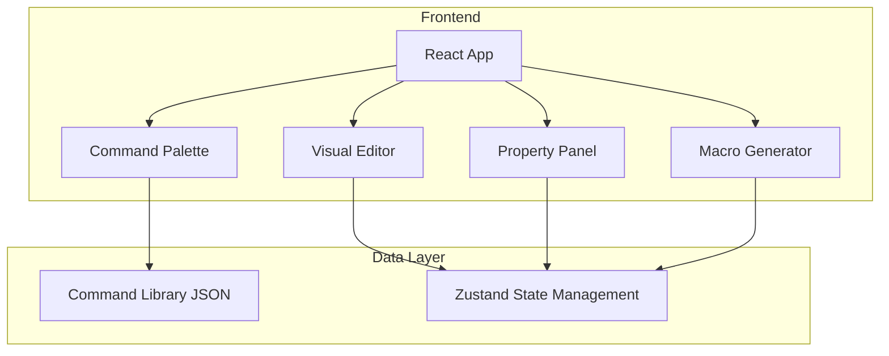

## 1. Architecture Design


## 2. Technology Description
- Frontend: React@18 + TypeScript + tailwindcss@3 + vite
- Initialization Tool: vite-init
- Visual Editor: reactflow (for blueprint-style node editor)
- State Management: zustand
- Icons: lucide-react

## 3. Route Definitions
| Route | Purpose |
|-------|---------|
| / | Visual macro editor (main page) |
| /reference | Command library reference |

## 4. Data Model

### 4.1 Command Types
```typescript
interface MacroCommand {
  id: string;
  name: string;
  category: CommandCategory;
  syntax: string;
  description: string;
  parameters: Parameter[];
  example: string;
}

enum CommandCategory {
  ACTION = 'action',
  TEXT = 'text',
  WAIT = 'wait',
  TARGET = 'target',
  UI = 'ui',
  UTILITY = 'utility',
  CONDITIONAL = 'conditional'
}

interface Parameter {
  name: string;
  type: 'string' | 'number' | 'select';
  required: boolean;
  options?: string[];
  defaultValue?: string;
  description: string;
}
```

### 4.2 Node State
```typescript
interface MacroNode {
  id: string;
  type: string;
  position: { x: number; y: number };
  data: {
    command: MacroCommand;
    params: Record<string, string>;
  };
}

interface Connection {
  id: string;
  source: string;
  target: string;
}

interface AppState {
  nodes: MacroNode[];
  connections: Connection[];
  selectedNode: MacroNode | null;
  setNodes: (nodes: MacroNode[]) => void;
  setConnections: (connections: Connection[]) => void;
  selectNode: (node: MacroNode | null) => void;
  generateMacro: () => string;
}
```

## 5. Project Structure
```
/workspace
├── src/
│   ├── components/
│   │   ├── editor/
│   │   │   ├── Canvas.tsx
│   │   │   ├── CommandNode.tsx
│   │   │   └── ConnectionLines.tsx
│   │   ├── sidebar/
│   │   │   ├── CommandPalette.tsx
│   │   │   ├── PropertyPanel.tsx
│   │   │   └── MacroOutput.tsx
│   │   └── common/
│   │       ├── Header.tsx
│   │       └── Navigation.tsx
│   ├── data/
│   │   └── commands.ts
│   ├── hooks/
│   │   └── useMacroStore.ts
│   ├── pages/
│   │   ├── Editor.tsx
│   │   └── Reference.tsx
│   ├── utils/
│   │   └── macroGenerator.ts
│   ├── App.tsx
│   └── main.tsx
├── public/
├── index.html
├── package.json
├── tailwind.config.js
├── tsconfig.json
└── vite.config.ts
```

## 6. Core Implementation Logic

### 6.1 Macro Generation Flow
1. Nodes are sorted by their position on canvas (top to bottom)
2. For each node, parameters are injected into command template
3. Command lines are joined with newlines
4. Output is formatted as valid FF14 macro text

### 6.2 FF14 Macro Syntax Rules
- Each command starts with `/`
- Max 15 lines per macro
- Supports `<wait.X>` for delays
- Supports `<t>`, `<me>`, `<mo>` for target placeholders
- Comments start with `//`

### 6.3 Command Categories
- Action commands: `/ac`, `/action`, `/wac`
- Text commands: `/p`, `/say`, `/echo`
- Wait commands: `/wait`, `<wait.X>`
- Target commands: `/target`, `/focus`
- UI commands: `/hotbar`, `/icon`
- Utility commands: `/macroicon`, `/merror`
