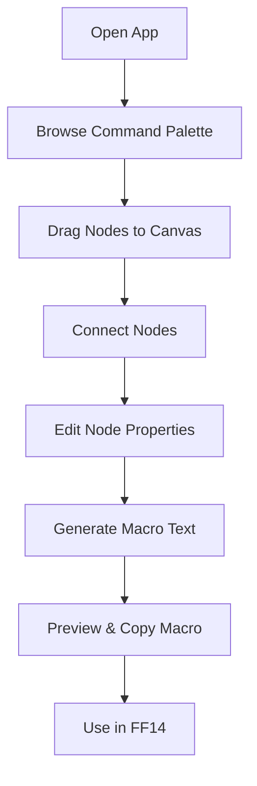

## 1. Product Overview
一款可视化FF14宏指令生成应用，允许用户通过拖拽和连线的方式（类似UE蓝图）设计宏流程，最终输出符合FF14语法的可复制文本。解决FF14宏编写复杂、难以可视化编辑的问题，面向FF14玩家群体。

## 2. Core Features

### 2.1 User Roles
| Role | Registration Method | Core Permissions |
|------|---------------------|------------------|
| FF14 Player | None (local app) | Full access to all features |

### 2.2 Feature Module
1. **Visual Editor Page**: Blueprint-style canvas, command palette, property panel
2. **Macro Output Page**: Generated macro text, copy function, preview
3. **Command Library Page**: FF14 macro command reference, examples

### 2.3 Page Details
| Page Name | Module Name | Feature description |
|-----------|-------------|---------------------|
| Visual Editor Page | Canvas | Drag and drop macro command nodes, connect nodes with lines |
| Visual Editor Page | Command Palette | Categorized FF14 macro commands, search function |
| Visual Editor Page | Property Panel | Edit node parameters, preview command text |
| Macro Output Page | Text Editor | Display generated macro, syntax highlighting |
| Macro Output Page | Copy Function | One-click copy to clipboard |
| Command Library Page | Reference Guide | Detailed FF14 macro syntax and examples |

## 3. Core Process
用户从命令面板拖拽宏指令节点到画布 → 连接节点形成执行流程 → 在属性面板编辑节点参数 → 系统实时生成宏文本 → 用户预览并复制宏指令

## 4. User Interface Design

### 4.1 Design Style
- Primary colors: Deep fantasy purple (#6B46C1), gold accent (#D69E2E)
- Button style: Rounded, with subtle gradient and hover effects
- Fonts: Display font - Orbitron (tech/fantasy vibe), Body font - Inter
- Layout style: Dark theme, glass-morphism panels, multi-column grid
- Icon style: Line-art fantasy themed icons

### 4.2 Page Design Overview
| Page Name | Module Name | UI Elements |
|-----------|-------------|-------------|
| Visual Editor Page | Canvas | Dark grid background, snap-to-grid, zoom controls |
| Visual Editor Page | Command Palette | Sidebar with categories, search bar, scrollable list |
| Visual Editor Page | Property Panel | Right sidebar, form inputs, real-time preview |
| Macro Output Page | Text Area | Monospace font, line numbers, copy button |
| Command Library Page | Reference Cards | Card-based layout, collapsible sections |

### 4.3 Responsiveness
Desktop-first design, with responsive grid layout and touch-optimized interactions for tablet devices.

### 4.4 Visual Design Guidance
- Background: Dark fantasy themed with subtle texture
- Effects: Glass-morphism panels, soft shadows, glow effects on active elements
- Animation: Smooth transitions for node dragging, subtle pulse for selected nodes
- Mood: Dark, magical, tech-inspired atmosphere matching FF14 aesthetic
